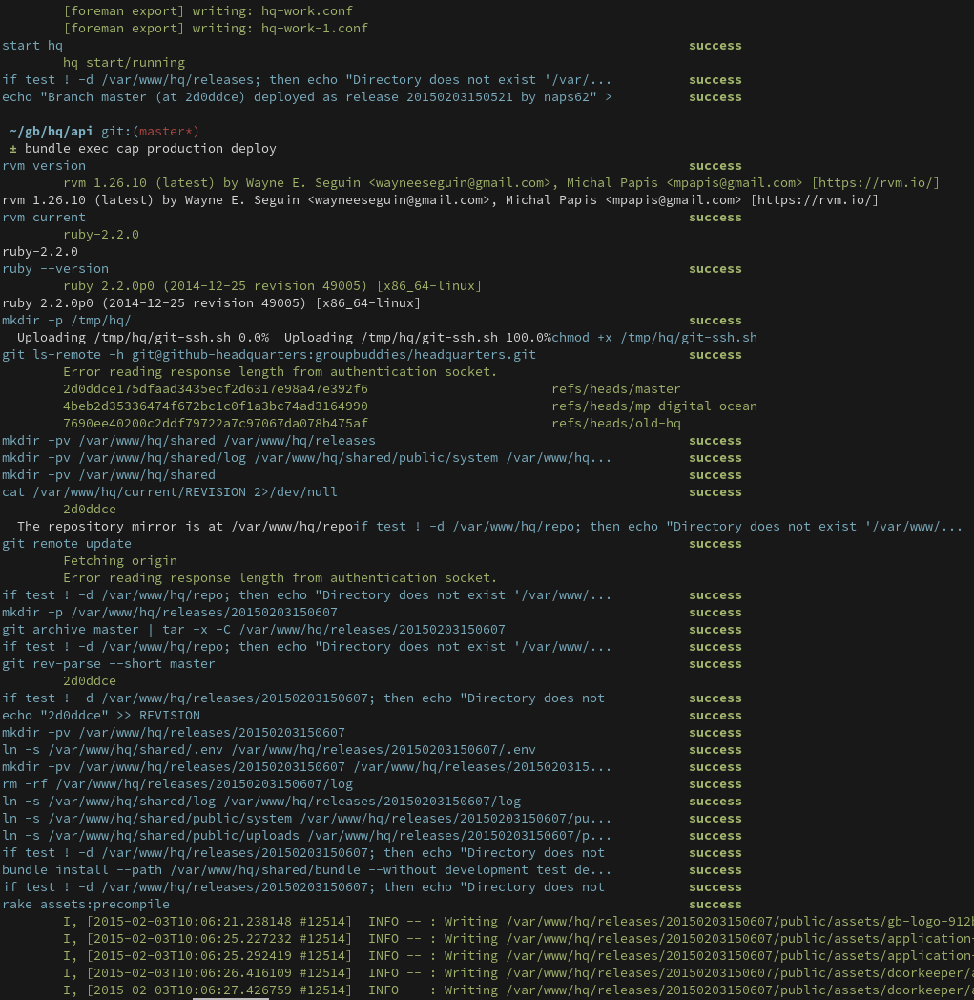

# Capistrano::Compact::Formatter

Custom formatter for Capistrano 3, with compact output, and opinionated according to my own needs.

I don't like the built-in formatters from sshkit. They're too verbose in debug mode, but too little verbose otherwise. Everytime an error occurred while using `set :debug, :info`, I would find myself changing it back to `:debug` to see the actual error messages.

This custom formatter has no regards for the log level (I don't use it anyway), but prints all commands within a single line, with the command executed and a success flag.
If a command produces output it will be printed below, in red or green, depending wether it comes from stdout or sterr, respectively.

Sample output:



## Installation

Add this line to your application's Gemfile:

```ruby
gem 'capistrano-compact-formatter'
```

Or install it yourself as:

    $ gem install capistrano-compact-formatter

## Usage

And require it in your `Capfile`

```ruby
# Capfile

require 'capistrano-compact-formatter'
```

Then in your `config/deploy.rb`, specify the formatter to use:

```ruby
# config/deploy.rb

set :format, :compact
```

And you're all set!

## Contributing

1. Fork it ( https://github.com/[my-github-username]/capistrano-compact-formatter/fork )
2. Create your feature branch (`git checkout -b my-new-feature`)
3. Commit your changes (`git commit -am 'Add some feature'`)
4. Push to the branch (`git push origin my-new-feature`)
5. Create a new Pull Request
